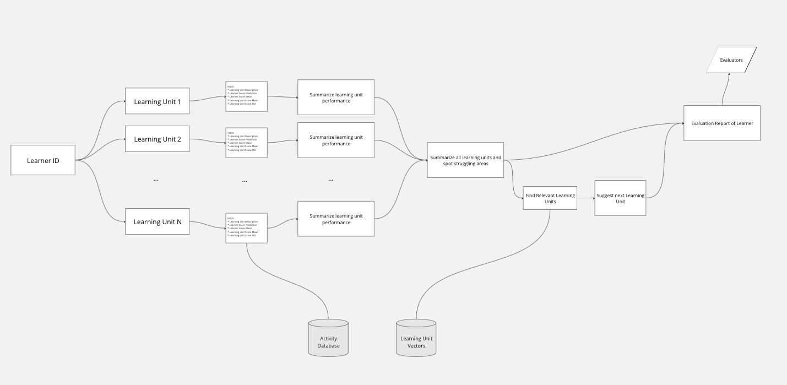

# Learner Evaluator

Modeling learner activity to predict scores on learning units.

## Setup

Install dependencies:
```bash
poetry install
```

Populate the storages:
```bash
# In separate terminal
docker-compose up
```

Then:
```bash
poetry run python scripts/init_knowledge_graph.py
poetry run python scripts/init_vector_store.py
```

Export environment variables
```bash
export OPENAI_API_KEY="$(cat OpenAIKey.txt)"

# (Optional) For model evaluation
export LANGCHAIN_TRACING_V2=...
export LANGCHAIN_ENDPOINT=...
export LANGCHAIN_PROJECT=...
export LANGCHAIN_API_KEY=...
```

## Usage

See `modeling/static_modeling.ipynb` for the experiments of a few models.

Run the Learner Evaluator:
```bash
poetry run langchain serve --port=8100
```

Go to http://localhost:8100/evaluate_learner/playground to run queries on learners.

Go to http://localhost:8100/query_knowledge_graph/playground to run queries on the knowledge graph.


## Overview

### Part 1: Score Prediction

Two models were trained and evaluated both as regressors and classifiers. The models were XGBoost and TabNet. These were chosen because of the small size of dataset,
and appearance of several categorical features. I took a static approach, meaning the features are N-dimensional and non-temporal because I didn't consider the
amount of activity per user to be large enough to train a time-series prediction model.

The models were not fitting the data so well, having high RMSE for regressors and low f1-score for classifiers. I took the XGBoost regressor to be used in Challenge 2 because it had the best performance of the two.

### Part 2: Learner Evaluation

Using the best regression model from the previous challenge, I created a pipeline that evaluates a learner's knowledge state. The approach to estimate the knowledge state is as follows:

1. Prompt an LLM to briefly describe the perfomance of a learner in every learning unit. This we consider to be a description of the knowledge state. Each learning unit is prompted separately. Provided in the prompt are:
  * Score prediction from the Challenge 1 model
  * Learner's average score and standard deviation of the learning unit
  * Average score and standard deviation of the learning unit by all learners
  * Details of the learning unit like strand, exercise type, description, etc.
  * Details of the learner like grade and gender
2. Prompt an LLM to identify skills and concepts a learner might be struggling with. Provided in the prompt are:
   * All the assessments done by the LLM in the every learning unit
   * Details of the learner like grade and gender
3. Prompt an LLM to suggest the next learning unit the learner should do, given that the goal is to improve their language skills. Provided in the prompt are:
   * Assessment of the skills and concepts a learner struggles with from the previous step
   * Top 4 learning units matched using the embeddings of the assessment
   * Details of the learner

At the end, the outputs for the 3 prompts are shown at the same time, which we take to be an evaluation of a learner's performance in the platform.

#### QA: Feedback Loop and Testing

We make use of LangChain to trace the inputs and outputs of the chain. This offers strong debugging
capabilities since we can inspect each step individually and spot where problems might be happening.
Lanchaing also allows us to look at existing runs and save inputs/outputs as part of a dataset.
This way we can start building test datasets, that can be used to evaluate the chain.

We evaluate the output with two metrics: for conciseness on the answer and that it contains
and actual learning unit. We can monitor these metrics in LangChain and look out for inputs
that are resulting in non-acceptable outputs.

We want to make sure every step of the model is generating or producing correct output, otherwise, the
chain of steps we have will propagate errors. Also, any changes we make to the prompts can cause unexpected
effects, so without tests, we might be causing performance regression. Furthermore, we want to create
QA datasets that we test our prompts and models against.

I provided a short example of how I would approach the testing in `scripts/quality_assurance.py`. I queried
the records for the highest and lowest average scores of a learning unit and learner. I used those
as low and high knowledge state examples and saved the outputs of the LLM, making sure they made sense.
This dataset is evaluated and several metrics are taken. This is to ensure our prompt is well-built and the
model correctly assess the performance of the student.

In production, this would scale into a bigger test suite, where each step in the chain is tested. Specifically,
the steps building a prompt and querying a model, as well as our retriever using the vector store. We would
also have tests for the entire chain, where we test the Learner Evaluator with mock learners.

#### Pipeline of the Evaluator



#### Potential improvements

1. Assert that the summarization of all learning units results returns a correct assessment.
2. Build a dataset of expected outputs of each query to the LLM to perform prompt engineering with confidence.
3. Figure out how to concurrently query for the learning unit summaries, as it is a sequential operation right now.
4. Use the Knowledge Graph to look for learning units from learners with similar activity.
5. Confirm/enhance the suggested learning units with the Knowledge Graph i.e. units with low score or activity.
6. Provide filtering options (like grade) to the relevant learning units retriever.

### Bonus: Knowledge Graph

Using the learning activity, learner details, and course descriptions, I populated a Knowledge Graph with different nodes and relations. This KG can be queried using regular english. Under the hood, it is using an LLM to build a Cypher query, which is then used on the KG, and the results are fed back again to the LLM for an answer.

Example queries:

* Who has never done the learning unit 'OneCourse:OC_TalkingHead.1dac'?
* What's the average score of learning unit 'OneCourse:OC_TalkingHead.1dac' for students who took it on Tuesday?
* Which learning unit is done most often in the public schools?

#### Potential improvements

1. Letting an LLM ingesting free text data to build the nodes and relations.
2. Storing embeddings of the sample Cypher queries, then do similarity search using the given query to provide relevant few-shot samples.
3. Storing the reports as nodes, along with the suggested learning unit.
